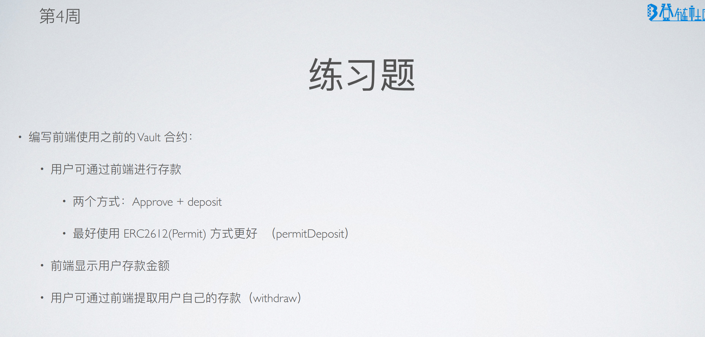
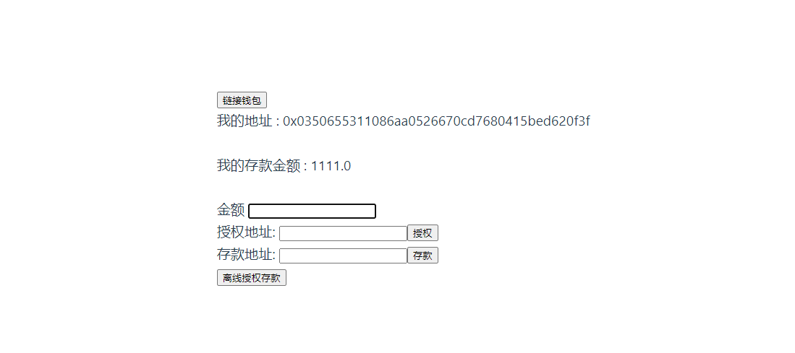
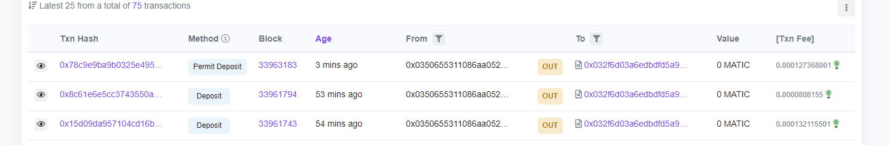
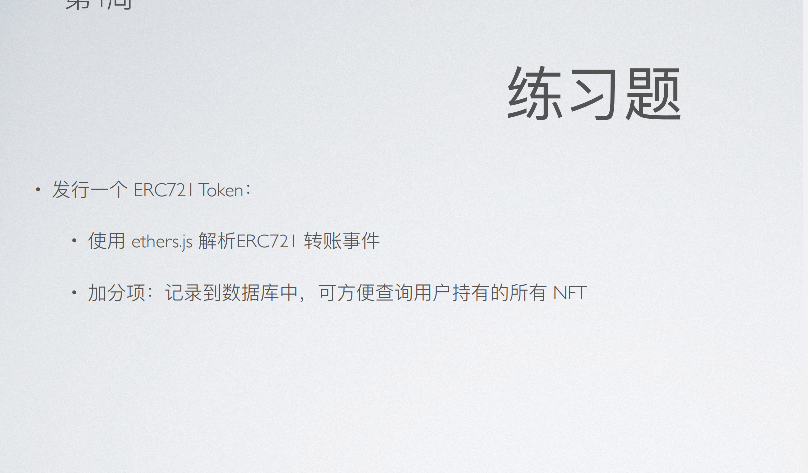
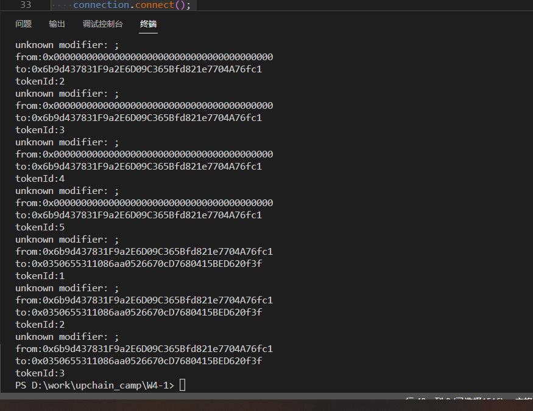
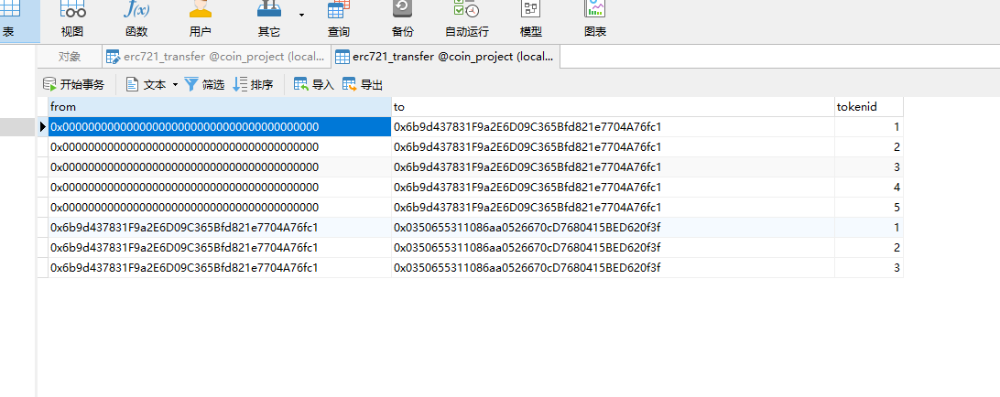

## 作业1:





| ERC2612:0xFac37C3523eB1e4Fec597e7AF039BFD1cc87b24F |
| -------------------------------------------------- |
| vault:0x032f6D03a6EdbDFd5a9d43B96A4aE4225B20793d   |

```
 approve(){
      let amount = ethers.utils.parseUnits(this.amount, 18);
      console.log("amount:"+amount);
      //预估gas
      let gas =  this.erc20Token.estimateGas.approve(this.recipient, amount).then((r) => {
        console.log("gasLimit:"+r);
      });
      //调用合约的时候怎么指定gas

      this.erc20Token.approve(this.recipient, amount,{gasLimit:200000}).then((r) => {
        console.log(r);  // 返回值不是true
        this.readContract();
      })
    },
    //q: 为什么这里的amount要乘以10的18次方，而不是直接用amount
    //a: 因为erc20的token的最小单位是wei，而我们的token是18位小数，所以要乘以10的18次方
    deposit(){
      let amount = ethers.utils.parseUnits(this.amount, 18);
      this.bank.deposit(amount).then((r)=>{
        console.log(r);
        this.readContract();
      });
    },


    async permitDeposit() {
      try {
        let nonce = await this.erc20Token.nonces(this.account);
        this.deadline = Math.ceil(Date.now() / 1000) + parseInt(20 * 60);
        console.log("amount:"+this.amount);
        let amount = ethers.utils.parseUnits(this.amount, 18);
        
        const domain = {
            name: await this.erc20Token.name(),
            version: '1',
            chainId: this.chainId,
            verifyingContract: erc2612Addr.address
        }

        const types = {
            Permit: [
              {name: "owner", type: "address"},
              {name: "spender", type: "address"},
              {name: "value", type: "uint256"},
              {name: "nonce", type: "uint256"},
              {name: "deadline", type: "uint256"}
            ]
        }

        const message = {
            owner: this.account,
            spender: bankAddr.address,
            value: amount,
            nonce: nonce ,
            deadline: this.deadline
        }

        const signature = await this.signer._signTypedData(domain, types, message);
        console.log(signature);

        const {v, r, s} = ethers.utils.splitSignature(signature);
        console.log("v:",v);
        console.log("r:",r);
        console.log("s:",s);
        let tx = await this.bank.permitDeposit( amount,this.deadline, v, r, s);
        console.log("tx",tx);
        let receipt = await tx.wait();
        console.log("receipt",receipt);
        this.readContract();
      } catch (e) {
        console.log(e);
        console.log(e.message);
        alert("Error , please check the console log:", e)
      }
      


    },
```





### 交易hash:

| approve        | https://mumbai.polygonscan.com/tx/0x02e19af39cb7039dff16631d89d47ca31184d3ed8dfb05b959299f6f5c2f2422 |
| -------------- | ------------------------------------------------------------ |
| deposit        | https://mumbai.polygonscan.com/tx/0x15d09da957104cd16bb1b8c46fad57b5a75b3a120bc553df6318f42dfa2c2345 |
| Permit Deposit | https://mumbai.polygonscan.com/tx/0x78c9e9ba9b0325e4953a933b3ab9d69dcbd6e160ad09a0cc71822dc3bb76ea0f |



```
const { ethers } = require("ethers");
const mysql = require('mysql');
const connection = mysql.createConnection({
    host: '127.0.0.1',
   // port:"3306",
    user: 'root',
    password: 'root',
    database: 'coin_project'
  });
  

const ERC721Addr = "0xEb260E0E5d0a00FCf4Ff6bB583BDBc0Ad43a020b";
const ERC20721ABI = require(`./ERC721ABI.json`)


async function parseTransferEvent(event) {
    const TransferEvent = new ethers.utils.Interface(["event Transfer(address indexed from, address indexed to, uint256 indexed tokenId);"]);
    let decodedData = TransferEvent.parseLog(event);
    let from = decodedData.args.from;
    let to = decodedData.args.to;
    let tokenId = decodedData.args.tokenId;
    console.log("from:" + from);
    console.log("to:" + to);
    console.log("tokenId:" + tokenId);

    // insert to db
    const insertObj = { from: from, to: to, tokenId: tokenId };
   
    connection.query('INSERT INTO erc721_transfer SET ?', insertObj);
   
}
async function main (){
    connection.connect();
    const provider = new ethers.providers.JsonRpcProvider("http://127.0.0.1:7545");
    
    let my721 = new ethers.Contract(ERC721Addr,ERC20721ABI,provider);

    let filter = my721.filters.Transfer();
    filter.fromBlock = 1;
    filter.toBlock = 1000;
    let events = await provider.getLogs(filter);
    console.log(events);
    for(let i = 0;i < events.length ;i++){
        parseTransferEvent(events[i]);
    }
    connection.end();
}
main();
```

### 解析到的事件数据:



### 保存数据到本地mysql:

