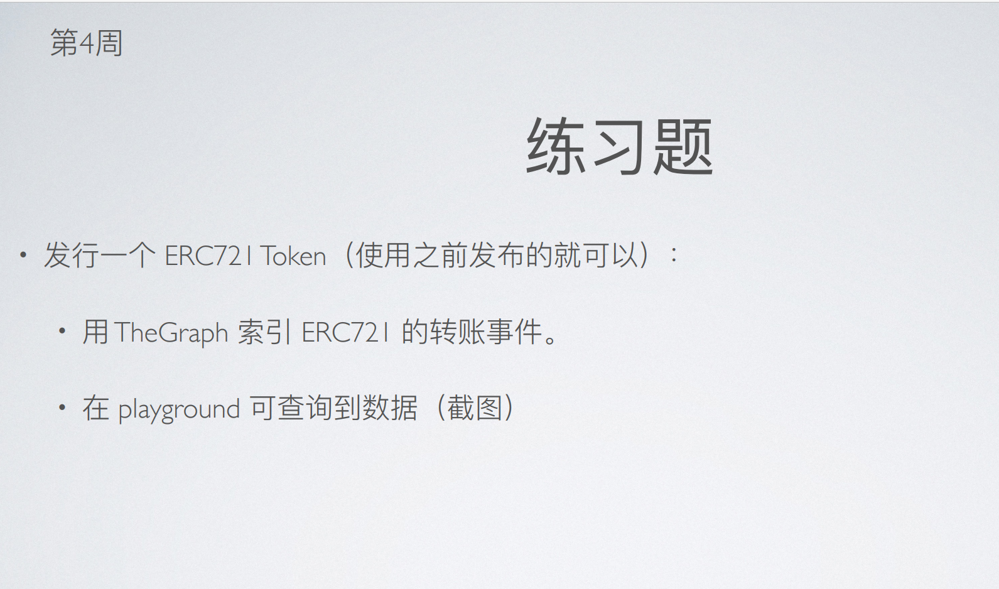
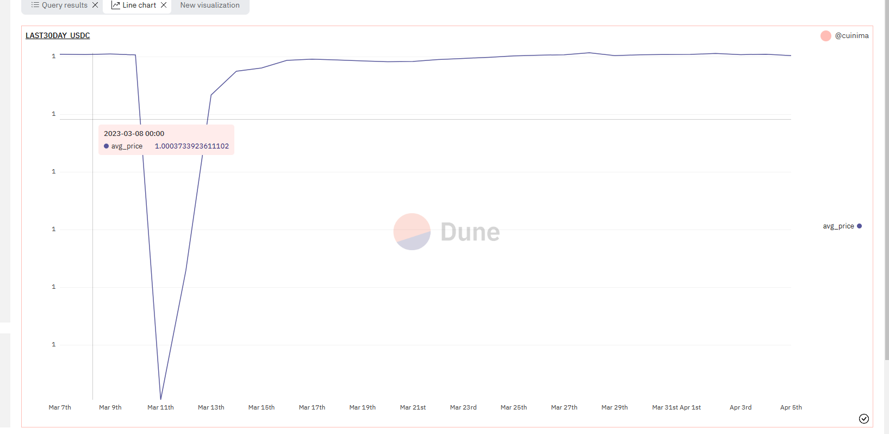
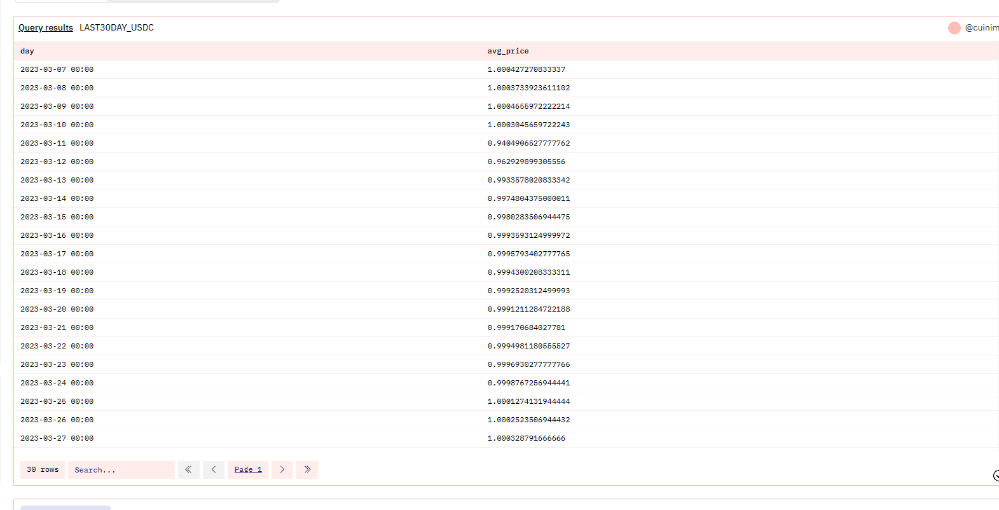

## 作业1:



### netsh winhttp set proxy 127.0.0.1:7777

 as day,
avg(price) as avg_price
from prices."usd"  
where 
"symbol"='USDC' 
and "blockchain"='ethereum' 
and "contract_address"=0xa0b86991c6218b36c1d19d4a2e9eb0ce3606eb48 
and DATE_TRUNC('day',minute) > DATE_TRUNC('day',NOW()) - INTERVAL '30' day
group by DATE_TRUNC('day',minute) order by day
```



